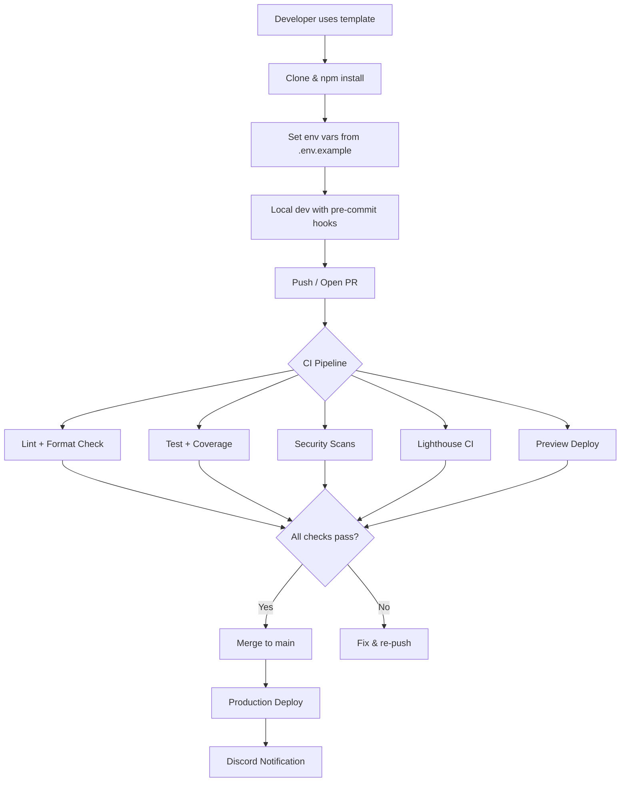
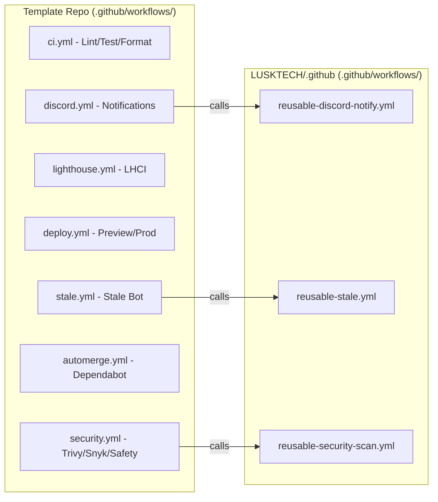
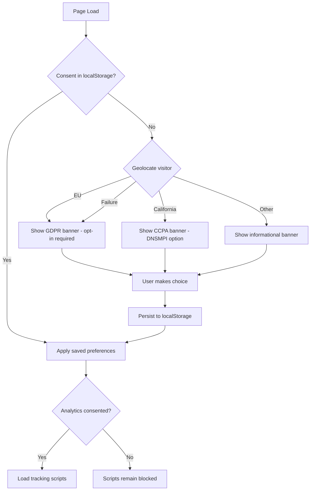

# Design Document: Website Template Repository

## Overview

This design describes the architecture for a reusable website template repository for Lusk Technologies, Inc. The template provides a standardized starting point for new website projects, bundling compliance pages, analytics/monitoring integrations, security tooling, CI/CD workflows, GitHub community documents, and deployment support for Vercel and Netlify.

The template is framework-agnostic at the page level (placeholder pages use plain HTML/JSX patterns) but assumes a modern JavaScript/TypeScript stack with a build step (e.g., Next.js, Astro, or similar). Reusable CI/CD workflows live in the `LUSKTECH/.github` repository and are called from thin caller workflows inside the template.

### Design Goals

- Zero-config start: `Use this template` → clone → `npm install` → working site with all tooling active
- Secret-guarded CI: every optional integration skips cleanly when its secret is absent
- Single source of truth: reusable workflows in `LUSKTECH/.github`, caller stubs in the template
- Platform-agnostic deployment: ship to Vercel or Netlify with the same repo
- Compliance by default: cookie banner, privacy policy, terms of service, and security headers out of the box

### Key Design Decisions

| Decision | Rationale |
|---|---|
| Next.js as reference framework | Most popular React meta-framework; SSR/SSG support; native Vercel integration; easy Netlify adapter |
| TypeScript throughout | Type safety for env validation, component props, and config files |
| `LUSKTECH/.github` for reusable workflows | Centralizes CI patterns; template repos only carry thin caller workflows |
| Local storage for cookie consent | No server-side dependency; GDPR-compliant when combined with consent-before-tracking |
| Zod for env validation | Runtime + build-time schema validation with clear error messages |
| fast-check for property-based testing | Mature JS/TS PBT library with good ecosystem support |

## Architecture

The template repository is organized into four layers:

```
┌─────────────────────────────────────────────────────────┐
│                    Deployment Layer                       │
│  vercel.json · netlify.toml · Security Headers · Preview │
├─────────────────────────────────────────────────────────┤
│                    Application Layer                      │
│  Pages · Components · SEO · Cookie Banner · Error Pages  │
├─────────────────────────────────────────────────────────┤
│                  Integration Layer                        │
│  Analytics · Axiom · Sentry · Env Validation             │
├─────────────────────────────────────────────────────────┤
│                    CI/CD Layer                            │
│  GitHub Actions · Reusable Workflows · Dependabot        │
│  Lint · Test · Security Scans · Deploy · Notifications   │
└─────────────────────────────────────────────────────────┘
```

### High-Level Flow



### CI/CD Workflow Architecture



### Secret-Guard Pattern

Every workflow job that depends on an optional secret uses a conditional check:

```yaml
jobs:
  scan:
    if: ${{ secrets.SOME_TOKEN != '' }}
    # or using environment variable:
    # if: ${{ vars.SOME_ENABLED == 'true' }}
    steps:
      - run: echo "Running scan..."
```

When the secret is absent, the job is skipped with a neutral status (not failure). The workflow file includes a companion `skip-notice` job that logs which integration was skipped and why.

## Components and Interfaces

### 1. Page Components

#### Privacy Policy Page (`/privacy`)
- Static page with placeholder sections: Data Collection, Data Usage, Third-Party Sharing, User Rights, Contact Information
- Cross-links to Terms of Service page
- Props: none (static content with site-wide layout)

#### Terms of Service Page (`/terms`)
- Static page with placeholder sections: Acceptable Use, Intellectual Property, Limitation of Liability, Governing Law, Contact Information
- Cross-links to Privacy Policy page

#### Custom Error Pages
- `404.tsx` — "Page Not Found" with navigation back to home
- `500.tsx` — "Server Error" with user-friendly message
- Both use the site layout and branding

### 2. Cookie Consent System



#### CookieBanner Component
```typescript
interface CookieConsentState {
  essential: true; // always true, non-toggleable
  analytics: boolean;
  marketing: boolean;
  region: 'eu' | 'ccpa' | 'general';
  consentedAt: string; // ISO 8601 timestamp
  version: string; // consent schema version for future migrations
}

interface CookieBannerProps {
  geolocationEndpoint?: string; // override for testing
  onConsentChange?: (state: CookieConsentState) => void;
}
```

#### CookiePreferences Component
- Accessible from footer link and from the banner itself
- Displays toggle for each cookie category
- Reads/writes `CookieConsentState` from localStorage
- Immediately enables/disables tracking scripts on change

### 3. Integration Layer

#### Analytics Integration
```typescript
interface AnalyticsConfig {
  provider: 'google-analytics' | 'plausible' | 'umami';
  trackingId: string;
  enabled: boolean; // derived from env var presence
}

// Initialization is gated on cookie consent
function initAnalytics(config: AnalyticsConfig, consent: CookieConsentState): void;
```

#### Axiom Integration
```typescript
interface AxiomConfig {
  token: string;
  dataset: string;
  enabled: boolean; // false when AXIOM_TOKEN is unset
}

// Logs page views, errors, and web vitals
interface AxiomLogger {
  logPageView(path: string, metadata?: Record<string, unknown>): void;
  logError(error: Error, context?: Record<string, unknown>): void;
  logWebVitals(metrics: WebVitalsMetrics): void;
}
```

#### Sentry Integration
```typescript
interface SentryConfig {
  dsn: string;
  enabled: boolean; // false when SENTRY_DSN is unset
  environment: string;
  tracesSampleRate: number;
}

// Client + server initialization
function initSentry(config: SentryConfig): void;
```

### 4. SEO Metadata Component

```typescript
interface SEOProps {
  title: string;
  description: string;
  image?: string;
  url: string;
  type?: 'website' | 'article';
  twitterCard?: 'summary' | 'summary_large_image';
  jsonLd?: Record<string, unknown>; // JSON-LD structured data
}

// Renders <meta> tags for OG, Twitter, canonical URL, and JSON-LD script
function SEOHead(props: SEOProps): JSX.Element;
```

### 5. Environment Variable Validation

```typescript
import { z } from 'zod';

const envSchema = z.object({
  // Required — build fails without these
  NEXT_PUBLIC_SITE_URL: z.string().url(),

  // Optional — warnings only
  NEXT_PUBLIC_GA_ID: z.string().optional(),
  AXIOM_TOKEN: z.string().optional(),
  SENTRY_DSN: z.string().url().optional(),
  SENTRY_AUTH_TOKEN: z.string().optional(),
  DISCORD_WEBHOOK_URL: z.string().url().optional(),
  VERCEL_TOKEN: z.string().optional(),
  NETLIFY_AUTH_TOKEN: z.string().optional(),
  // ... additional env vars
});

type Env = z.infer<typeof envSchema>;

// At build time: parse process.env, log warnings for missing optional vars,
// throw for missing required vars
function validateEnv(): Env;
```

### 6. CI/CD Workflows

#### Template Repo Workflows (`.github/workflows/`)

| Workflow File | Trigger | Secret Guard | Description |
|---|---|---|---|
| `ci.yml` | push, PR | None (always runs) | Lint (ESLint), format check (Prettier), test + coverage |
| `security.yml` | PR, weekly schedule | `TRIVY_ENABLED`, `SNYK_TOKEN`, `SAFETY_API_KEY` | Trivy, Snyk, Safety CLI scans |
| `lighthouse.yml` | PR | `LHCI_GITHUB_APP_TOKEN` | Lighthouse CI performance/a11y/SEO checks |
| `deploy-preview.yml` | PR | `VERCEL_TOKEN` or `NETLIFY_AUTH_TOKEN` | Preview deployment |
| `deploy-production.yml` | push to main | `VERCEL_TOKEN` or `NETLIFY_AUTH_TOKEN` | Production deployment |
| `stale.yml` | daily schedule | None | Calls reusable stale bot workflow |
| `automerge.yml` | PR (Dependabot) | None | Auto-merges patch/minor Dependabot PRs |
| `discord-notify.yml` | workflow_run | `DISCORD_WEBHOOK_URL` | Calls reusable Discord notification workflow |
| `sonarqube.yml` | PR, push to main | `SONAR_TOKEN` | SonarQube analysis |
| `qlty.yml` | PR | `QLTY_TOKEN` | qlty.sh code quality |
| `codecov.yml` | (part of ci.yml) | `CODECOV_TOKEN` | Coverage upload step |
| `a11y.yml` | PR | None (always runs) | axe-core accessibility testing |

#### Reusable Workflows (`LUSKTECH/.github/.github/workflows/`)

| Workflow File | Inputs | Description |
|---|---|---|
| `reusable-discord-notify.yml` | `webhook_url`, `status`, `repo_name`, `run_url` | Sends formatted Discord embed |
| `reusable-stale.yml` | `days_before_stale`, `days_before_close`, `exempt_labels` | Labels and closes stale issues/PRs |
| `reusable-security-scan.yml` | `scan_type` (trivy/snyk/safety), token secrets | Runs the specified security scanner |

### 7. Pre-Commit Hooks

```
.husky/
  pre-commit    → npx lint-staged
  commit-msg    → npx commitlint --edit $1
```

**lint-staged config** (in `package.json` or `.lintstagedrc`):
```json
{
  "*.{ts,tsx,js,jsx}": ["eslint --fix", "prettier --write"],
  "*.{json,md,yml,yaml,css}": ["prettier --write"]
}
```

### 8. Static Files and Configuration

| File | Purpose |
|---|---|
| `robots.txt` | Allow all crawlers, reference sitemap URL |
| `sitemap.xml` (or auto-generated) | Page listing for search engines |
| `manifest.json` / `site.webmanifest` | PWA manifest with placeholder name/colors/icons |
| `favicon.ico`, `favicon-16x16.png`, `favicon-32x32.png`, `apple-touch-icon.png` (180x180), `android-chrome-192x192.png`, `android-chrome-512x512.png` | Favicon set |
| `.prettierrc` | Prettier formatting rules |
| `.prettierignore` | Exclude build output, node_modules, etc. |
| `lighthouserc.js` | Lighthouse CI thresholds |
| `codecov.yml` | Coverage thresholds |
| `.qlty.toml` | qlty.sh quality gates |
| `sonar-project.properties` | SonarQube project config |
| `.github/dependabot.yml` | Dependabot ecosystems + schedule |
| `.github/CODEOWNERS` | Ownership rules |
| `.github/FUNDING.yml` | Funding links |
| `.github/PULL_REQUEST_TEMPLATE.md` | PR checklist |
| `.github/ISSUE_TEMPLATE/bug_report.yml` | Bug report template |
| `.github/ISSUE_TEMPLATE/feature_request.yml` | Feature request template |
| `.github/ISSUE_TEMPLATE/question.yml` | General question template |
| `SECURITY.md` | Vulnerability disclosure policy |
| `CODE_OF_CONDUCT.md` | Contributor Covenant |
| `CONTRIBUTORS.md` | Contributor list |
| `LICENSE` | Placeholder license |

## Data Models

### Cookie Consent State

Stored in `localStorage` under key `lusk-cookie-consent`:

```typescript
interface CookieConsentState {
  essential: true;
  analytics: boolean;
  marketing: boolean;
  region: 'eu' | 'ccpa' | 'general';
  consentedAt: string; // ISO 8601
  version: string;     // e.g., "1.0" — for future schema migrations
}
```

### Environment Variable Schema

Defined via Zod schema (see Components section). Categories:

| Category | Variables | Required? |
|---|---|---|
| Core | `NEXT_PUBLIC_SITE_URL` | Yes |
| Analytics | `NEXT_PUBLIC_GA_ID` | No |
| Axiom | `AXIOM_TOKEN`, `AXIOM_DATASET` | No |
| Sentry | `SENTRY_DSN`, `SENTRY_AUTH_TOKEN` | No |
| Lighthouse | `LHCI_GITHUB_APP_TOKEN` | No |
| Codecov | `CODECOV_TOKEN` | No |
| Security | `TRIVY_ENABLED`, `SNYK_TOKEN`, `SAFETY_API_KEY` | No |
| Quality | `SONAR_TOKEN`, `QLTY_TOKEN` | No |
| Deploy | `VERCEL_TOKEN`, `NETLIFY_AUTH_TOKEN` | No |
| Notifications | `DISCORD_WEBHOOK_URL` | No |

### SEO Metadata Model

```typescript
interface SiteMetadata {
  siteName: string;
  defaultTitle: string;
  defaultDescription: string;
  defaultImage: string; // OG image URL
  siteUrl: string;
  twitterHandle?: string;
  organization: {
    name: string;
    url: string;
    logo: string;
  };
}
```

### Security Headers Configuration

Defined in both `vercel.json` and `netlify.toml`:

```typescript
interface SecurityHeaders {
  'Content-Security-Policy': string;
  'X-Frame-Options': 'DENY' | 'SAMEORIGIN';
  'X-Content-Type-Options': 'nosniff';
  'Referrer-Policy': 'strict-origin-when-cross-origin';
  'Permissions-Policy': string;
  'Strict-Transport-Security': string;
}
```

### Dependabot Configuration Model

```yaml
# .github/dependabot.yml
version: 2
updates:
  - package-ecosystem: "npm"
    directory: "/"
    schedule:
      interval: "weekly"
  - package-ecosystem: "pip"
    directory: "/"
    schedule:
      interval: "weekly"
  - package-ecosystem: "github-actions"
    directory: "/"
    schedule:
      interval: "weekly"
```

### Stale Bot Configuration

Passed as inputs to the reusable workflow:

```typescript
interface StaleBotConfig {
  daysBeforeStale: number;    // default: 30
  daysBeforeClose: number;    // default: 7
  exemptLabels: string[];     // default: ['pinned', 'security']
  staleLabel: string;         // default: 'stale'
}
```

## Correctness Properties

*A property is a characteristic or behavior that should hold true across all valid executions of a system — essentially, a formal statement about what the system should do. Properties serve as the bridge between human-readable specifications and machine-verifiable correctness guarantees.*

### Property 1: Region-based banner selection

*For any* region code, the cookie banner type returned by the region classifier should match the regulatory classification of that region: EU member state codes → `'eu'` (GDPR), California → `'ccpa'`, all other regions → `'general'`. When geolocation fails (null/undefined input), the classifier should default to `'eu'` (most restrictive).

**Validates: Requirements 2.1, 2.3, 2.6**

### Property 2: Consent state round-trip persistence

*For any* valid `CookieConsentState` object, writing it to localStorage and reading it back should produce an identical object. Additionally, after persisting updated preferences, the consent state retrieved from storage should reflect the update.

**Validates: Requirements 2.5, 25.3**

### Property 3: Consent-gated script loading

*For any* `CookieConsentState`, analytics/tracking scripts should be loaded if and only if the `analytics` field is `true`. When `analytics` is `false`, no tracking script initialization should occur.

**Validates: Requirements 3.3**

### Property 4: Graceful degradation for missing integration env vars

*For any* optional integration (Analytics, Axiom, Sentry), when its required environment variable is absent (empty string or undefined), calling the integration's initialization function should not throw an error and should return a disabled/no-op instance.

**Validates: Requirements 3.2, 4.2, 5.2**

### Property 5: Axiom logger produces structured output

*For any* page path string, error object, or web vitals metrics object, calling the corresponding Axiom logger method should produce a structured log entry containing the input data and a timestamp.

**Validates: Requirements 4.3**

### Property 6: Sentry captures errors with metadata

*For any* `Error` object with a stack trace and any context metadata record, the Sentry capture function should produce a report containing the error message, stack trace, and all provided metadata keys.

**Validates: Requirements 5.3**

### Property 7: Secret-guarded workflows have skip conditionals

*For any* workflow YAML file in `.github/workflows/` that references a secret from the set of optional secrets, the workflow should contain an `if` conditional that checks for the presence of that secret before running the guarded job.

**Validates: Requirements 17.1**

### Property 8: Secret-guarded workflows log skip notices

*For any* workflow YAML file in `.github/workflows/` that has a secret guard, the workflow should contain a companion job or step that logs an informational message naming the missing secret and the skipped workflow when the guard condition is false.

**Validates: Requirements 17.2**

### Property 9: Cookie preferences UI reflects stored state

*For any* valid `CookieConsentState` stored in localStorage, the cookie preferences component should render toggle states that match the stored `essential`, `analytics`, and `marketing` boolean values.

**Validates: Requirements 25.2**

### Property 10: Environment validation distinguishes required vs optional

*For any* environment variable defined in the Zod schema, if the variable is marked as required and its value is missing, `validateEnv()` should throw an error. If the variable is marked as optional and its value is missing, `validateEnv()` should log a warning but not throw.

**Validates: Requirements 28.2, 28.3**

### Property 11: CSP builder produces valid header from config

*For any* set of allowed domain strings, the CSP builder function should produce a Content-Security-Policy header string that includes each provided domain in the appropriate directive and conforms to CSP syntax (semicolon-separated directives, space-separated sources).

**Validates: Requirements 29.3**

### Property 12: Commitlint validates conventional commits

*For any* string that matches the Conventional Commits pattern (`type(scope): description`), commitlint should pass validation. *For any* string that does not match the pattern, commitlint should reject it.

**Validates: Requirements 30.3**

### Property 13: SEO component renders correct meta tags

*For any* valid `SEOProps` object (with title, description, url, and optional image), the SEO component's rendered output should contain an `og:title` meta tag with the title value, an `og:description` meta tag with the description value, a `twitter:card` meta tag, and a canonical `<link>` tag with the URL value.

**Validates: Requirements 33.1, 33.2**

### Property 14: JSON-LD produces valid structured data

*For any* organization data object (name, url, logo), the JSON-LD generator should produce a valid JSON string that parses to an object with `@context` equal to `"https://schema.org"`, `@type` equal to `"Organization"`, and fields matching the input values.

**Validates: Requirements 33.3**

## Error Handling

### Integration Failures

| Scenario | Behavior |
|---|---|
| Geolocation API unreachable | Default to GDPR (most restrictive) banner |
| Analytics env var missing | No-op analytics instance; no runtime errors |
| Axiom token missing | No-op logger; logs silently discarded |
| Sentry DSN missing | Sentry SDK not initialized; errors go uncaptured |
| Sentry source map upload fails | Build continues; warning logged |
| localStorage unavailable (private browsing) | Cookie consent falls back to session-only state; banner re-shows on next visit |

### Build-Time Validation

| Scenario | Behavior |
|---|---|
| Required env var missing | Build fails with clear error message naming the variable |
| Optional env var missing | Warning logged to console; build continues |
| Env var has wrong format (e.g., invalid URL) | Build fails with Zod validation error describing expected format |

### CI/CD Failures

| Scenario | Behavior |
|---|---|
| Secret missing for optional workflow | Job skipped with neutral status; skip-notice job logs the reason |
| Lighthouse scores below threshold | PR check fails; scores reported in check output |
| Security scan finds critical vulnerability | PR check fails; findings reported |
| Dependabot PR fails checks | Automerge does not trigger; PR stays open for manual review |
| Discord webhook URL invalid | Notification step fails silently; does not block the pipeline |

### Runtime Errors

| Scenario | Behavior |
|---|---|
| Unhandled exception (Sentry enabled) | Error captured with stack trace and context; user sees 500 page |
| Unhandled exception (Sentry disabled) | Error logged to console; user sees 500 page |
| 404 route | Custom 404 page with navigation back to home |
| Cookie consent state corrupted in localStorage | Reset to default (no consent); re-show banner |

## Testing Strategy

### Dual Testing Approach

This project uses both unit tests and property-based tests for comprehensive coverage:

- **Unit tests** (Vitest): Verify specific examples, edge cases, integration points, and file/config existence
- **Property-based tests** (fast-check + Vitest): Verify universal properties across randomly generated inputs

Both are complementary — unit tests catch concrete bugs and validate specific scenarios, while property tests verify general correctness across the input space.

### Unit Test Coverage

Unit tests focus on:

1. **File and config existence**: Verify all required files exist (config files, community documents, workflow files, favicon set, etc.)
2. **Config content validation**: Verify workflow YAML files have correct triggers, secret guards, and job structure
3. **Page rendering**: Verify privacy policy, terms of service, 404, and 500 pages render with expected content
4. **Component rendering**: Verify SEO component, cookie banner, and cookie preferences render correctly for specific inputs
5. **Integration setup**: Verify analytics, Axiom, and Sentry initialization for specific config scenarios
6. **Edge cases**: localStorage unavailable, corrupted consent state, empty/malformed env vars

### Property-Based Test Coverage

Each correctness property from the design is implemented as a single property-based test using `fast-check`. Tests are configured with a minimum of 100 iterations.

| Property | Test Description | Tag |
|---|---|---|
| 1 | Region classifier maps codes to correct banner type | Feature: website-template-repo, Property 1: Region-based banner selection |
| 2 | Consent state survives localStorage round-trip | Feature: website-template-repo, Property 2: Consent state round-trip persistence |
| 3 | Tracking scripts load iff analytics consent is true | Feature: website-template-repo, Property 3: Consent-gated script loading |
| 4 | Missing env vars produce no-op integrations without errors | Feature: website-template-repo, Property 4: Graceful degradation for missing integration env vars |
| 5 | Axiom logger methods produce structured entries | Feature: website-template-repo, Property 5: Axiom logger produces structured output |
| 6 | Sentry capture includes error + metadata | Feature: website-template-repo, Property 6: Sentry captures errors with metadata |
| 7 | Workflow YAML files contain secret-guard conditionals | Feature: website-template-repo, Property 7: Secret-guarded workflows have skip conditionals |
| 8 | Workflow YAML files contain skip-notice jobs | Feature: website-template-repo, Property 8: Secret-guarded workflows log skip notices |
| 9 | Preferences UI toggles match stored consent state | Feature: website-template-repo, Property 9: Cookie preferences UI reflects stored state |
| 10 | Env validator errors on required, warns on optional | Feature: website-template-repo, Property 10: Environment validation distinguishes required vs optional |
| 11 | CSP builder output includes all configured domains | Feature: website-template-repo, Property 11: CSP builder produces valid header from config |
| 12 | Commitlint accepts valid and rejects invalid messages | Feature: website-template-repo, Property 12: Commitlint validates conventional commits |
| 13 | SEO component output contains all meta tags | Feature: website-template-repo, Property 13: SEO component renders correct meta tags |
| 14 | JSON-LD output is valid schema.org Organization | Feature: website-template-repo, Property 14: JSON-LD produces valid structured data |

### Test Configuration

- **Test runner**: Vitest (with `--run` flag for CI, no watch mode)
- **Property-based testing library**: fast-check (latest stable version)
- **Coverage**: Istanbul via Vitest's built-in coverage, output in lcov format for Codecov
- **Minimum PBT iterations**: 100 per property
- **CI integration**: Tests run on every PR and push to main via `ci.yml` workflow
- **Tag format**: Each property test includes a comment: `// Feature: website-template-repo, Property {N}: {title}`

### Test File Organization

```
__tests__/
  unit/
    pages/          # Page rendering tests
    components/     # Component unit tests (SEO, cookie banner)
    config/         # Config file existence and content tests
    workflows/      # Workflow YAML structure tests
    integrations/   # Analytics, Axiom, Sentry init tests
  properties/
    region-classifier.property.test.ts
    consent-persistence.property.test.ts
    consent-gated-scripts.property.test.ts
    graceful-degradation.property.test.ts
    axiom-logger.property.test.ts
    sentry-capture.property.test.ts
    workflow-guards.property.test.ts
    workflow-skip-notices.property.test.ts
    cookie-preferences.property.test.ts
    env-validation.property.test.ts
    csp-builder.property.test.ts
    commitlint.property.test.ts
    seo-component.property.test.ts
    json-ld.property.test.ts
```
